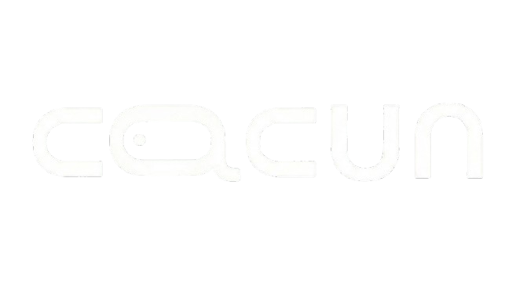

# 🌿 Cacun - Nature-first Marketplace



<div style="display: flex; align-items: center; justify-content: flex-start; gap: 0px;">
  
  
  
  
  
</div> 

---

## 🌍 About Cacun

Cacun is a revolutionary **nature-first marketplace** dedicated to promoting sustainable living through eco-friendly products. Our platform connects conscious consumers with vendors who share our commitment to environmental protection.

### 🎯 Our Mission

To create a world where every purchase contributes to a healthier planet by offering:
- **Plastic-free alternatives**
- **Non-toxic products**
- **Recycled materials**
- **Nature-based solutions**
- **Reusable options**

## ✨ Key Features

### 🛍️ **Product Categories**
- **Plastic Free** - Packaging and products with zero plastic use
- **Non Toxic** - Safe beauty, soap, detergents, farm items and daily essentials
- **Recycled Material** - Shoes, clothes, carry bags, pouches, boxes, furniture and more
- **Nature Products** - Leafy plates, edible spoons, coconut coir scrub, organic skincare
- **Reuse Products** - Refillable bottles, reusable shampoo packaging, cleaner capsules

### 🌱 **Campaigns & NGOs**
- Join clean-earth missions and track impact through your purchases
- Support verified organizations working on waste reduction and nature protection
- Real-time impact tracking and reporting

### 📱 **Modern User Experience**
- **Responsive Design** - Works seamlessly on all devices
- **Royal Theme** - Premium royal blue and gold color scheme
- **Smooth Animations** - Engaging scroll-triggered animations
- **Advanced Search** - Find products quickly with intelligent search
- **Social Integration** - Connect with eco-conscious community

## 🛠️ **Technology Stack**

### **Frontend**
- **React** - Modern component-based architecture
- **CSS3** - Advanced styling with custom properties
- **JavaScript ES6+** - Modern JavaScript features
- **Responsive Grid/Flexbox** - Mobile-first design approach

### **Design System**
- **Royal Blue & Gold Theme** - Premium color palette
- **Custom Animations** - Smooth transitions and micro-interactions
- **Component Library** - Reusable UI components
- **Accessibility** - WCAG compliant design

## 🚀 **Getting Started**

### **Prerequisites**
- Node.js (v14 or higher)
- npm or yarn
- Modern web browser

### **Installation**
```bash
# Clone the repository
git clone https://github.com/AyushHarinkhede/cacun.git

# Navigate to project directory
cd cacun

# Install dependencies
npm install

# Start development server
npm start
```

### **Build for Production**
```bash
# Build optimized production bundle
npm run build

# Preview production build
npm run preview
```

## 📁 **Project Structure**

```
cacun/
├── Client/
│   ├── Components/
│   │   ├── Home/           # Home page components
│   │   ├── Navbar/         # Navigation bar
│   │   ├── Footer/         # Footer section
│   │   ├── ProductsSection/ # Product listings
│   │   └── ...             # Other components
│   ├── scripts/
│   │   └── animations.js   # Scroll animations
│   ├── App.css             # Global styles
│   └── index.css           # Theme variables
├── public/
│   └── cacun.png           # Logo
├── index.html              # Main HTML file
└── README.md               # This file
```

## 🎨 **Design Features**

### **Responsive Design**
- Mobile-first approach
- Fluid typography
- Flexible grid layouts
- Touch-friendly interactions

### **Animations**
- Scroll-triggered animations
- Smooth page transitions
- Interactive hover effects
- Loading animations

### **Accessibility**
- Semantic HTML5
- ARIA labels
- Keyboard navigation
- Screen reader support

## 🌟 **Key Highlights**

### **Environmental Impact**
- Every product is vetted for environmental compliance
- Carbon footprint tracking for purchases
- NGO partnership program
- Campaign impact metrics

### **User Experience**
- Intuitive navigation
- Advanced filtering options
- Wishlist and favorites
- Secure checkout process

### **Community Features**
- User reviews and ratings
- Social sharing capabilities
- Eco-challenges and rewards
- Community forums

## 🤝 **Contributing**

We welcome contributions from developers who share our vision for a sustainable future!

### **How to Contribute**
1. Fork the repository
2. Create a feature branch (`git checkout -b feature/amazing-feature`)
3. Commit your changes (`git commit -m 'Add amazing feature'`)
4. Push to the branch (`git push origin feature/amazing-feature`)
5. Open a Pull Request

### **Development Guidelines**
- Follow existing code style
- Write clean, commented code
- Test your changes thoroughly
- Update documentation as needed

## 📞 **Contact & Support**

### **Get in Touch**
- **Email**: support@cacun.com
- **Phone**: +91 98765 43210
- **Location**: Mumbai, India
- **Live Chat**: Available on website

### **Follow Us**
- **Instagram**: [@cacun](https://instagram.com/cacun)
- **Twitter**: [@cacun](https://twitter.com/cacun)
- **LinkedIn**: [Cacun Official](https://linkedin.com/company/cacun)

## 📄 **Legal**

- **Privacy Policy**: Comprehensive data protection
- **Terms of Service**: Clear usage guidelines
- **User Rights**: Respect for user privacy and rights

## 🏆 **Acknowledgments**

- All our NGO partners working towards environmental protection
- The eco-conscious community that inspires us daily
- Contributors who help make Cacun better
- Nature itself - our greatest teacher

---

## 🌈 **Join the Movement**

Be part of the solution, not the pollution. Every small step counts towards a greener future.

**🌱 Together, we can make a difference!**

---

<div align="center">
  
</div>

---

**© 2025 Cacun. All rights reserved. Made with ❤️ for nature lovers**
